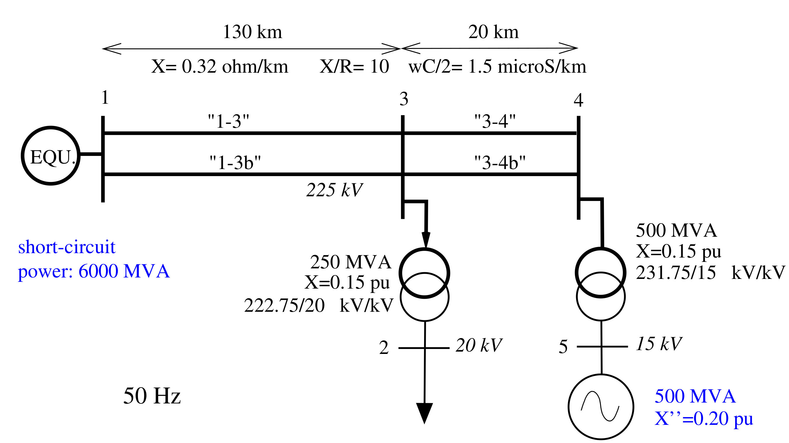

# Dynamic analysis of a 5-bus test system

If you have JupyterLab installed with [pyramses](https://pyramses.sps-lab.org) then these data will get you started on running some basic dynamic simulations on a 5-bus test system.

Simply load the folder in JupyterHub and open the Execute notebook. Follow the instructions in the [presentation](./present_5bus_syst.pdf).

The original code and exercises are from [Prof. Thierry Van Cutsem](https://thierryvancutsem.github.io/).

